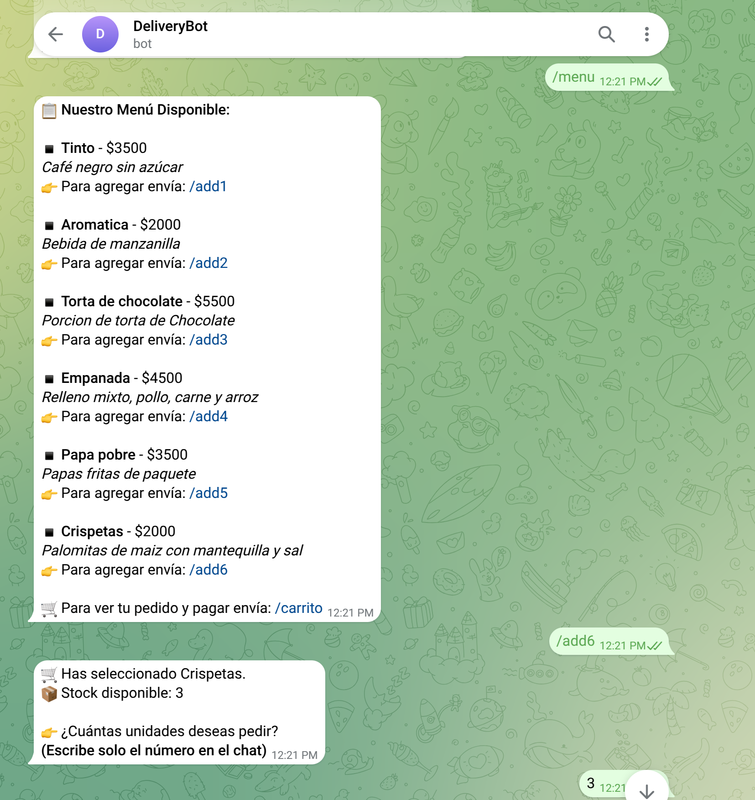
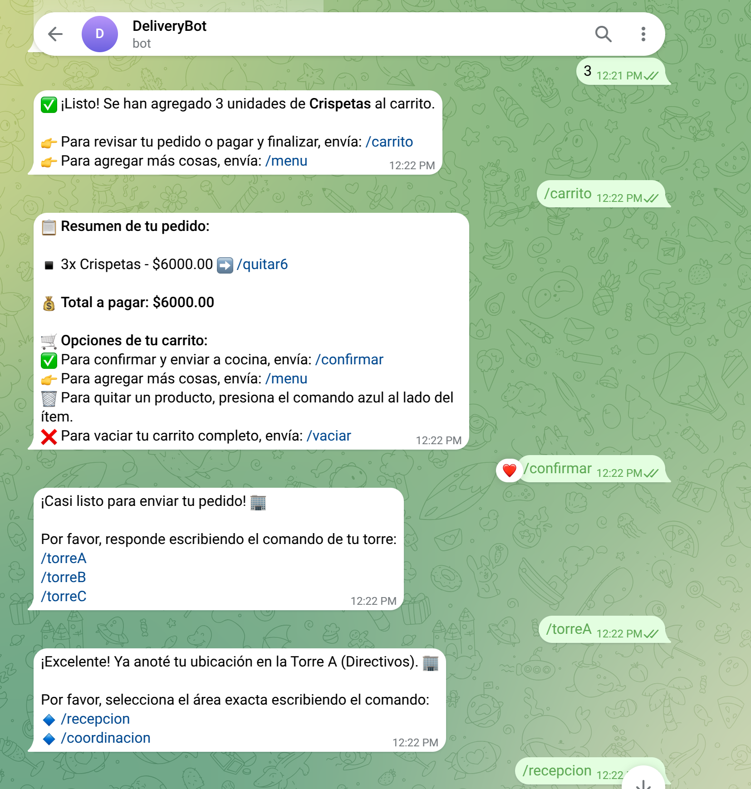
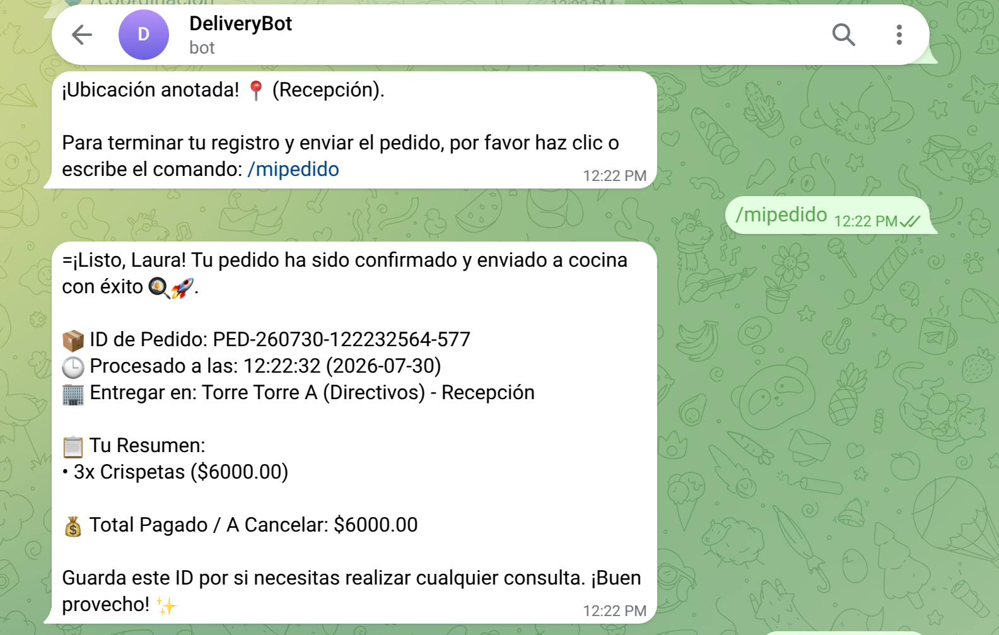
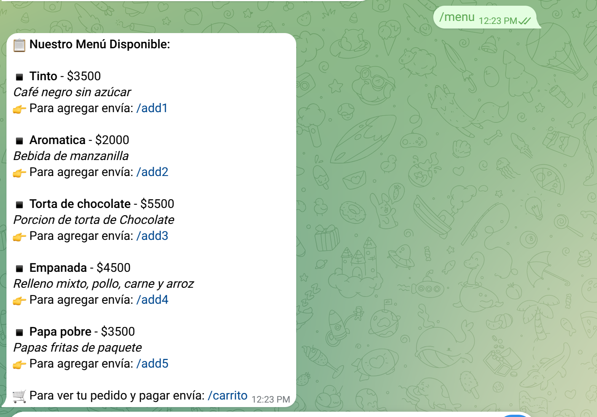
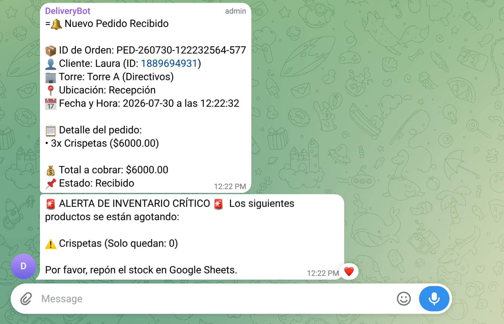

# 🤖 DeliveryBot - Sistema Automatizado de Pedidos y Reportes

DeliveryBot es un bot de Telegram automatizado mediante **n8n**, diseñado para gestionar, registrar, enviar a cocina y analizar el historial de pedidos de un negocio, conectándose de manera fluida con Google Sheets y procesando analíticas en tiempo real.

---

## 🚀 Características Principales

* **Gestión Interactiva del Carrito:** Permite a los clientes explorar el menú, armar su pedido, vaciarlo o consultarlo directamente en el chat mediante comandos rápidos.
* **Registro de Datos de Usuario:** Captura el nombre del usuario mediante un comando específico antes de procesar el pedido.
* **Ubicación de Entrega Específica:** Permite definir el destino exacto dentro de las instalaciones usando comandos dedicados (*torre*, *salón*, *recepción* o *coordinación*).
* **Integración con Cocina:** Envía los pedidos confirmados directamente al área de cocina para su preparación inmediata.
* **Gestión Inteligente de Inventario:** 
  * Descuenta automáticamente el stock en Google Sheets con cada pedido.
  * Cambia el estado a "Agotado" cuando el stock llega a 0, reflejándose inmediatamente en el menú interactivo.
  * Emite una **alerta de stock crítico** a los administradores si un producto llega a 3 unidades o menos.
* **Sincronización con Google Sheets:** Almacena automáticamente cada transacción, usuario, ubicación y estado en una hoja de cálculo centralizada.
* **Procesamiento de Datos en JavaScript:** Un nodo de código dedicado analiza y calcula métricas clave de ventas y operaciones.
* **Reportes para Administradores:** Envía resúmenes detallados de ingresos, productos más vendidos y horas pico.

---

## 📸 Galería del Bot en Acción

### 1. Flujo de un Pedido Exitoso
El cliente puede explorar el menú, seleccionar cantidades y definir su ubicación de entrega de manera fluida e interactiva.





### 2. Control de Inventario Automático (Stock Agotado)
Cuando un producto llega a stock 0, el sistema actualiza Google Sheets marcándolo como "Agotado", lo que bloquea automáticamente su venta y lo muestra actualizado en el chat para futuros clientes.



### 3. Recepción en Cocina y Alertas de Stock Crítico
La cocina recibe una notificación instantánea con todos los detalles del pedido para su preparación. Adicionalmente, el bot evalúa el inventario y adjunta una alerta preventiva si el stock de algún producto se ha vuelto crítico (≤ 3 unidades).



---

## ⌨️ Comandos del Chatbot

Los usuarios y clientes pueden interactuar con el bot utilizando los siguientes comandos:

* `/start` - Inicia la conversación y despliega el saludo y menú de bienvenida.
* `/menu` - Muestra la lista de productos disponibles para ordenar.
* `/add [producto]` - Añade un producto al carrito de compras actual.
* `/quitar [producto]` - Elimina o resta un producto del carrito.
* `/carrito` - Muestra los productos que tienes seleccionados actualmente en el carrito.
* `/vaciar` - Vacía por completo el carrito de compras actual.
* `/confirmar` - Finaliza el carrito actual, registra el pedido completo (con usuario y ubicación) en Google Sheets, **lo envía a cocina** e inicializa su ciclo de estados.
* `/torre [Detalle]` - Especifica la torre de entrega (ej. `/torre B`).
* `/salon [Detalle]` - Especifica el salón de entrega (ej. `/salon 302`).
* `/recepcion` - Indica que la entrega se realizará en recepción.
* `/coordinacion` - Indica que la entrega se realizará en coordinación.
* `/mipedido` - Guarda el nombre del usuario para asociarlo al pedido que está por realizar.
* `/reporte` *(Exclusivo para administradores)* - Genera el reporte completo de ventas, ingresos y productos más vendidos.

---

## 🔄 Flujo y Estados del Pedido

Una vez que el cliente confirma su orden, el pedido sigue un flujo automatizado de estados gestionado por el bot:

1. **Realizado:** El pedido se ha registrado correctamente en la base de datos y se ha notificado a cocina.

---

## 🛠️ Stack Tecnológico

* **Automatización:** n8n (Self-hosted o Cloud)
* **Base de Datos / Almacenamiento:** Google Sheets
* **Interfaz de Usuario:** Telegram Bot API
* **Lógica y Procesamiento:** JavaScript (NodeJS)

---

## 📦 Estructura del Flujo en n8n

1. **Telegram Trigger:** Escucha los mensajes y comandos entrantes de los usuarios (como `/menu`, `/mipedido`, `/torre`, `/confirmar`, etc.).
2. **Google Sheets (Get/Append Rows):** Lee o escribe los datos en la hoja de cálculo de pedidos.
3. **Nodo de Código (Analizar Datos y Generar Reporte):** Script en JavaScript encargado de filtrar, ordenar, sumar ingresos y estructurar el texto final del reporte de ventas.
4. **Telegram (Send Message):** Envía las respuestas, confirmaciones, avisos a cocina o estados del pedido de vuelta al chat.

---

## 💻 Script de Análisis de Ventas (JavaScript)

```javascript
// 1. Obtenemos todas las filas del nodo de Google Sheets
const pedidos = $('Get row(s) in sheet').all().map(item => item.json);

if (pedidos.length === 0) {
    return [{ json: { reporte_texto: "⚠️ No hay pedidos registrados todavía." } }];
}

let totalIngresos = 0;
let ventasPorProducto = {};
let ventasPorHora = {};
let totalPedidos = 0;

// 2. Analizamos pedido por pedido
pedidos.forEach(p => {
    if (p.estado !== "Cancelado") {
        totalPedidos++;
        
        totalIngresos += parseFloat(p.total_pago || 0);

        if (p.hora) {
            let horaCorta = String(p.hora).split(':')[0] + ":00";
            ventasPorHora[horaCorta] = (ventasPorHora[horaCorta] || 0) + 1;
        }

        if (p.detalles_pedido) {
            const lineas = p.detalles_pedido.split('\n');
            lineas.forEach(linea => {
                const match = linea.match(/•\s*(\d+)x\s*(.+?)\s*\(\$/);
                if (match) {
                    const cantidad = parseInt(match[1], 10);
                    const nombreProducto = match[2].trim();
                    ventasPorProducto[nombreProducto] = (ventasPorProducto[nombreProducto] || 0) + cantidad;
                }
            });
        }
    }
});

// 3. Ordenamos Top Productos
const arrayTopProductos = Object.entries(ventasPorProducto)
    .sort((a, b) => b[1] - a[1])
    .slice(0, 5)
    .map(prod => ({
        producto: prod[0],
        cantidad_vendida: prod[1]
    }));

// 4. Ordenamos Horas Pico
const arrayTopHoras = Object.entries(ventasPorHora)
    .sort((a, b) => b[1] - a[1])
    .slice(0, 3)
    .map(hora => ({
        hora: hora[0],
        cantidad_pedidos: hora[1]
    }));

// 5. Formateamos los textos para Telegram
const topProductosTexto = arrayTopProductos.map(p => `🍔 ${p.cantidad_vendida} uds - ${p.producto}`).join('\n');
const topHorasTexto = arrayTopHoras.map(h => `⏰ ${h.hora} (${h.cantidad_pedidos} pedidos)`).join('\n');

const mensajeReporte = `📊 *REPORTE DE VENTAS DELIVERYBOT*\n\n` +
                        `📦 *Total de Pedidos:* ${totalPedidos}\n` +
                        `💰 *Ingresos Totales:* $${totalIngresos.toFixed(2)}\n\n` +
                        `🏆 *TOP 5 - Productos más vendidos:*\n${topProductosTexto || "Sin datos"}\n\n` +
                        `🔥 *Horas de mayor afluencia:*\n${topHorasTexto || "Sin datos"}`;

// 6. Retornamos el JSON estructurado
return [{
    json: {
        total_pedidos: totalPedidos,
        ingresos_totales: totalIngresos,
        top_productos: arrayTopProductos,
        horas_pico: arrayTopHoras,
        reporte_texto: mensajeReporte
    }
}];V

